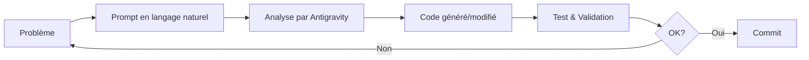

# 🏎️ Car Racing - Intelligence Artificielle Réactive

## 📋 Informations du Projet

| Élément | Détails |
|---------|---------|
| **Module** | Intelligence Artificielle Réactive |
| **Formation** | Master 2 IA CASA - EMSI |
| **Année** | 2025/2026 |
| **Auteurs** | **Saad SAMIH** & **Mehdi REDDAD** |

---

## 🎯 Description du Projet

Ce projet implémente une simulation de course automobile où des voitures autonomes apprennent à naviguer sur un circuit en utilisant:

- **Réseaux de Neurones (TensorFlow.js)** pour la prise de décision
- **Algorithme Génétique** pour l'évolution et l'apprentissage
- **Comportements de Steering** selon Craig Reynolds

### Objectif Principal

Créer des véhicules autonomes capables de:
1. Suivre un circuit généré procéduralement
2. Éviter les obstacles statiques et dynamiques
3. Apprendre progressivement à optimiser leur trajectoire
4. Respecter le sens unique de la piste

---

## � Explications Techniques

### Architecture du Réseau de Neurones

```
┌─────────────────┐     ┌──────────────────┐     ┌─────────────┐
│   ENTRÉES (7)   │────▶│   CACHÉE (14)    │────▶│ SORTIES (2) │
│  Rayons/Capteurs│     │    Activation:   │     │  Direction  │
│                 │     │     Sigmoid      │     │   Vitesse   │
└─────────────────┘     └──────────────────┘     └─────────────┘
```

| Couche | Neurones | Description |
|--------|----------|-------------|
| **Entrée** | 7 | Distances détectées par les rayons (capteurs) |
| **Cachée** | 14 | Traitement intermédiaire (sigmoid) |
| **Sortie** | 2 | Angle de direction + Vitesse |

### Système de Capteurs (Rays)

Chaque voiture possède **7 rayons** répartis de -45° à +45°:
- Détectent les murs et obstacles
- Renvoient une distance normalisée (0-1)
- Distance de sécurité: **15 pixels** avant collision

### Algorithme Génétique

```javascript
1. Initialisation: 100 véhicules avec cerveaux aléatoires
2. Évaluation: Fitness basée sur checkpoints + progression
3. Sélection: Probabilité proportionnelle à la fitness
4. Reproduction: Copie des meilleurs cerveaux
5. Mutation: 10% de chance de modifier les poids
6. Répétition: Nouvelle génération
```

---

## 🎮 Comportements et Mise en Situation

### Quand utiliser ce projet?

| Situation | Application |
|-----------|-------------|
| **Enseignement** | Démonstration des réseaux de neurones et algorithmes génétiques |
| **Recherche** | Expérimentation sur les comportements émergents |
| **Prototypage** | Base pour des simulations plus complexes |

### Comment ça marche?

1. **Génération du Circuit**: Utilisation de bruit de Perlin pour créer des pistes uniques
2. **Spawn des Voitures**: 100 véhicules démarrent au point de départ
3. **Évolution**: Les voitures qui passent plus de checkpoints survivent
4. **Apprentissage**: Après plusieurs générations, les voitures maîtrisent le circuit

### Qui sont les acteurs?

| Entité | Rôle |
|--------|------|
| **Vehicle** | Agent autonome avec cerveau neuronal |
| **NeuralNetwork** | Prend les décisions (direction/vitesse) |
| **Genetic Algorithm** | Sélectionne et fait muter les meilleurs |
| **Track** | Environnement généré procéduralement |
| **Obstacles** | Défis supplémentaires à éviter |

### Pourquoi ces choix?

- **TensorFlow.js**: Performance GPU, facile à intégrer dans le navigateur
- **Algorithme Génétique**: Pas besoin de données d'entraînement labellisées
- **p5.js**: Visualisation simple et réactive
- **Bruit de Perlin**: Circuits variés et naturels

---

## ⚠️ Difficultés Rencontrées

### 1. Performance de Rendu
**Problème**: L'utilisation de `tint()` pour colorer les images ralentissait considérablement la simulation.

**Solution**: Pré-rendu des sprites dans des buffers graphiques au démarrage.

```javascript
// AVANT (lent)
tint(100, 255, 100);
image(carImg, 0, 0, 30, 48);
noTint();

// APRÈS (rapide)
image(carImgBest, 0, 0);  // Image pré-teintée
```

### 2. Voitures en Sens Inverse
**Problème**: Les voitures apprenaient à rouler à l'envers pour maximiser leur fitness.

**Solution**: Système de détection du sens inverse avec pénalité de mort.

```javascript
if (dotProduct < -0.2) {
    this.wrongWay += 2;
    if (this.wrongWay > 30) {
        this.dead = true;  // Éliminé!
    }
}
```

### 3. Collisions Trop Tardives
**Problème**: Les voitures mouraient seulement à 5 pixels des murs, pas assez de temps pour réagir.

**Solution**: Distance de sécurité augmentée à 15 pixels.

```javascript
const SAFETY_DISTANCE = 15;
if (record < SAFETY_DISTANCE) this.dead = true;
```

### 4. Sortie de Piste
**Problème**: Les voitures pouvaient sortir du circuit sans pénalité.

**Solution**: Fonction `isOnTrack()` qui vérifie si la position est entre les bordures.

---

## 🏆 Ce Dont Nous Sommes Fiers

### ✨ Apprentissage Émergent
Les voitures développent des comportements complexes **sans programmation explicite**:
- Négociation des virages
- Évitement d'obstacles
- Optimisation de trajectoire

### 🎨 Interface Visuelle Attractive
- Voitures avec sprites 2D réalistes
- Circuit généré avec bruit de Perlin
- Meilleure voiture mise en évidence en vert
- Affichage des rayons de détection

### 🚀 Performance Optimisée
- Sprites pré-rendus pour meilleure FPS
- Slider de vitesse pour accélérer l'entraînement
- Backend CPU TensorFlow pour stabilité

### 🎮 Interactivité
- **Clic gauche**: Ajouter un obstacle
- **Clic sur obstacle**: Le supprimer
- **Slider**: Contrôler la vitesse de simulation

### � Système de Fitness Robuste
```javascript
fitness = checkpoints_passés + bonus_progression + bonus_tour
```

---

## 🤖 Outils IA Utilisés

### Antigravity (Gemini Pro)

| Aspect | Détails |
|--------|---------|
| **Assistant** | Antigravity (Google DeepMind) |
| **Modèle** | Gemini 2.5 Pro |
| **Utilisation** | Développement, débogage, optimisation |

### Exemples de Prompts Utilisés

#### 1. Vérification du Projet
```
see if the car racing using neuron network also the workspace rules
```
**Résultat**: Analyse complète de l'architecture NN et des règles du projet.

#### 2. Intégration des Images
```
for car use the image
```
**Résultat**: Implémentation du sprite 2D pour les voitures.

#### 3. Optimisation Performance
```
yes but with image is slow make it rapid
```
**Résultat**: Pré-rendu des sprites et suppression des appels `tint()`.

#### 4. Distance de Sécurité
```
ajoute une distance de sécurité plus pour éviter les obstacles avant de crasher
```
**Résultat**: Constante `SAFETY_DISTANCE = 15` implémentée.

### Workflow de Développement avec IA



---

## 📁 Structure du Projet

```
10-CarRacing/
├── index.html          # Page principale
├── car.png             # Sprite de voiture 2D
├── README.md           # Ce fichier
└── js/
    ├── sketch.js       # Logique principale (p5.js)
    ├── vehicle.js      # Classe Vehicle avec NN
    ├── nn.js           # Classe NeuralNetwork (TensorFlow.js)
    ├── ga.js           # Algorithme génétique
    ├── boundary.js     # Murs et checkpoints
    ├── ray.js          # Rayons/capteurs
    └── globals.js      # Constantes globales
```

---

## 🚀 Lancement

1. Ouvrir `index.html` dans un navigateur moderne
2. Observer les voitures apprendre
3. Utiliser le slider pour accélérer
4. Cliquer pour ajouter des obstacles

---

## 📚 Références

- [Craig Reynolds - Steering Behaviors](https://www.red3d.com/cwr/steer/)
- [The Nature of Code - Daniel Shiffman](https://natureofcode.com/)
- [TensorFlow.js Documentation](https://www.tensorflow.org/js)
- [p5.js Reference](https://p5js.org/reference/)

---

## 📄 Licence

Projet éducatif - Master 2 IA CASA - EMSI 2025/2026

**Auteurs**: Saad SAMIH & Mehdi REDDAD
